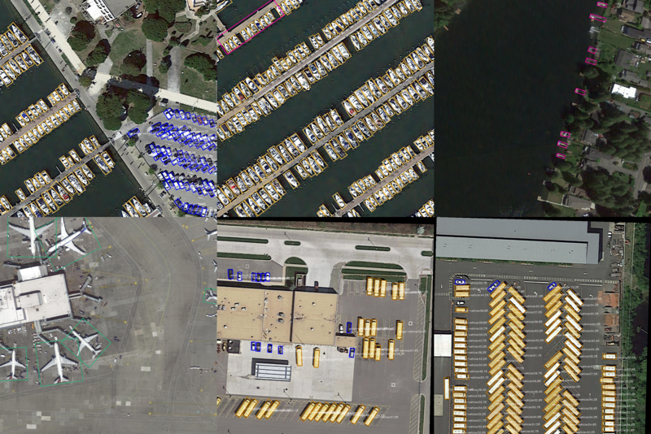

**YOLOX OBB -- YOLOX 旋转框 | 实例分割**


***

***

## **ForeWord**
  More rotated detection methods can reference [OBBDetection](https://github.com/jbwang1997/OBBDetection.git). And you can reference [知乎](https://zhuanlan.zhihu.com/p/430850089?) for more information
## **Introduction**

### Method
* **OBB** OBB -> PolyIoU Loss(OBBDetection) \ KLD Loss(NeurIPS2021) \ GWD Loss(ICML2021)
* **Inst** Inst-> SparseInst(CVPR2022) \ CondInst(ECCV2020) \ BoxInst(CVPR2021)

## **Content**

- [Quick&nbsp;Start](#Quick&nbsp;Start)
- [Instruction](#Instruction)
  - [Data](#Data)
  - [Demo](#Demo)
  - [Train](#Train)
  - [Test](#Test)

- [Ralated&nbsp;Hub](#Ralated&nbsp;Hub)

## **Quick&nbsp;Start**

Firstly, create python environment

```shell
conda create -n yolox_dect python=3.7 -y
```
then, install pytorch according to your machine, as cuda-10.2 and pytorch-1.7.0, you can install like following
```shell
conda activate yolox_dect
conda install pytorch==1.7.0 torchvision==0.8.0 torchaudio==0.7.0 cudatoolkit=10.2 -c pytorch -y
```
then, clone the github of the item and install requirements

```shell
git clone --recursive https://github.com/DDGRCF/YOLOX_OBB.git
cd YOLOX_OBB
pip3 install -U pip && pip3 install -r requirements.txt
pip3 install -v -e .
```
install BboxToolkit
```shell
cd BboxToolkit
python setup.py develop
```
## **Instruction**
### **Data**
#### **Convert Other data format into dota style**
If We want to train your datasets, firstly you first convert your data as dota datasets format. If you have a coco annotation-style datasets, you can just convert it annoatations into dota format. We perpare a script for you.
```shell
$ cd my_exps
$ bash coco2dota.sh
# PS: you should change filename、diranme and so on.
```
#### **Convert dota style into  BboxToolkit style**
This part please reference [BboxToolkit](./BboxToolkit/USAGE.md)


### **Demo**
I prepare the shell the demo script so that you can quick run obb demo as :
```shell
$ expn=... && exp=... && ckpt=... && cuda=... && img_path=...
$ bash my_exps/demo.sh ${expn} ${exp} ${ckpt} ${cuda} ${img_path} --output_format obb --save_result
```
 
### **Train**
```shell
$ expn=... && exp=... && cuda=... && num_device=... && batch_size=...
$ bash my_exps/train.sh ${expn} ${exp} ${cuda} ${num_device} ${batch_size} --fp16[optional] 
```
### **Test**
#### **OBB**
* eval online
```shell
$ expn=... && exp=... && ckpt=... && cuda=...
$ bash my_exps/eval_obb.sh ${expn} ${exp} ${ckpt} ${cuda} ${num_device} ${batch_size} --fuse[optional] --fp16[optional] --options is_merge=True
```
* generate submission file for *obb*
```shell
$ expn=... && exp=... && ckpt=... && cuda=... && num_device=... && batch_size=... 
$ bash my_exps/eval_obb.sh ${expn} ${exp} ${ckpt} ${cuda} ${num_device} ${batch_size} --fuse[optional] --fp16[optional] --options is_merge=True is_submiss=True --test
```
## **Results**
[MODEL_ZOO](https://pan.baidu.com/s/1k1k1JCq56Z-g9NrRtHNWhQ) | code: `tdm6`

|Model | image size | mAP | epochs |
| ------        |:---:  |  :---: |  :---: |
|[YOLOX_s_dota1_0](./exps/example/yolox_obb/yolox_s_dota1_0.py) |1024  | 70.82(73.17) | 80(137) |
|[YOLOX_s_dota2_0](./exps/example/yolox_obb/yolox_s_dota2_0.py) |1024  | 49.52 | 80 |
|[YOLOX_s_condinst_coco](./exps/example/yolox_obb/yolox_s_dota2_0.py) |1024  | 26.43 | 36 |
|[YOLOX_s_sparseinst_coco](./exps/example/yolox_obb/yolox_s_dota2_0.py) |1024  | 0.05(**error**) | 24 |
more results, wait...
## **Ralated&nbsp;Hub**

- [YOLOX](https://github.com/Megvii-BaseDetection/YOLOX.git)

- [OBBDetection](https://github.com/jbwang1997/OBBDetection.git)

- [BboxToolkit](https://github.com/jbwang1997/BboxToolkit.git)
